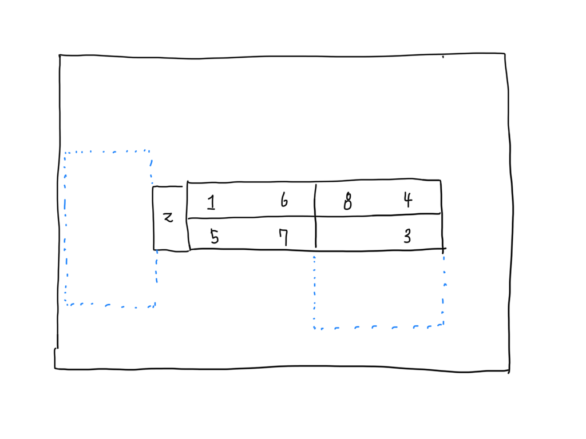

## 2020년 혁신성장 VR/AR/MR 융합 콘텐츠 개발 실무 프로젝트

### 모베리오 실습 프로젝트

- [프로젝트 소스 깃 허브](https://github.com/IndieGameMaker/SmartGlass)

## 프로젝트 01 - BT350을 활용한 MR 콘텐츠 개발 프로젝트

- 엡손 Moverio BT-350 기기를 활용해 혼합 현실(MR) 콘텐츠를 개발한다.
- 원칙상 1인 프로젝트로 진행
- 짧은 기간으로 인해 프로젝트의 핵심 기능만을 구현할 수 있도록 적절한 규모로 기획한다.
- 프로젝트 소스는 Github를 활용한다.(1인 프로젝트이지만 Git,Github 사용법을 습득하는 과정)
- 일정관리는 Trello.com을 활용한다. [(트렐로 trello.com)](https://trello.com)

### 프로젝트 기획 발표

- 프로젝트의 일정상 기획서 발표는 생략한다.
- 작성한 기획서는 구글 드라이브에 업로드 해주세요.[기획서 업로드](https://drive.google.com/drive/folders/1iaizUTAOOdXKdmKDvF3z4Ru_POlEnZB6?usp=sharing)

### 프로젝트 일정
| 일정          | 기간                        | 6/16 | 17  | 18  | 19  | 22  | 23  | 24  |
| ------------- | --------------------------- | ---- | --- | --- | --- | --- | --- | --- |
| 기획서 작성   | 2020/06/16                  | #    |     |     |     |     |     |     |
| 개발기간      | 2020/06/18 ~ 2020/06/24     |      |     | #   | #   | #   | #   | #   |
| 중간점검      | 생략                        |      |     |     |     |     |     |     |
| 발표 문서작성 | 2020/06/23 까지는 초안 작성 |      |     |     |     |     | #   |     |
| 발표 리허설   | 생략                        |      |     |     |     |     |     |     |
| 발표일        | 2020/06/24 17:00 부터       |      |     |     |     |     |     | #   |

### 프로젝트 팀
| 팀  | 프로젝트 명 | 팀명 | 팀원 | 팀장 | 발표자 |
| --- | ----------- | ---- | ---- | ---- | ------ |
| 1팀 |             |      |      |      |        |
| 2팀 |             |      |      |      |        |
| 3팀 |             |      |      |      |        |
| 4팀 |             |      |      |      |        |
| 5팀 |             |      |      |      |        |

### 프로젝트 발표 문서 작성

- [발표문서 공식 탬플릿](https://drive.google.com/file/d/1Md_cCOLKDtKy0DO5B_vdeiVO5sHdasWz/view?usp=sharing)

- 발표문서는 06월 24일 13:00 까지 아래 구글 드라이브에 업로드해주세요.(마감시간 엄수)
- [발표문서 업로드](https://drive.google.com/drive/folders/1c-WPWhrchkXj8nc1YAbuwdOSDh7bkyvo?usp=sharing)

### 프로젝트 발표 순서

- 발표일자 및 시간 : **2020/06/24 16:00 ~ 18:40**
- 팀별 발표 소요시간 : **발표와 질의 응답 3분(이내)**
- 발표 순서는 당일 오전에 결정됩니다.

- 개발 발표문서에 필수 포함될 내용
  - 개발환경 (유니티 버전, 개발 SDK, 사용 디바이스, 소스관리(Github), 일정관리(트렐로) 등등)
  - 개발일정 (기획, 개발, 디버깅, 테스트, 문서자료, 등등)
  - 개발후기 (개발시 느낀점, 스스로 보안이 필요하다고 생각하는 부분, 등등)

| 순서 | 프로젝트 명                       | 팀명   | 팀원 | 팀장 | 발표자 |
| ---- | --------------------------------- | ------ | ---- | ---- | ------ |
| 1팀  | 어둠의 공포                       | 차동윤 |      |      |        |
| 2팀  | 비주얼 조직도                     | 박해리 |      |      |        |
| 3팀  | 슈팅스타 맛초킹                   | 전승언 |      |      |        |
| 4팀  | 브레멘음악대                      | 이노훈 |      |      |        |
| 5팀  | 힐링 포레스트                     | 이준기 |      |      |        |
| 6팀  | RE:Re:Re<No subject> spin-off ver | 김서연 |      |      |        |
| 7팀  | 장바구니                          | 정재훈 |      |      |        |
| 8팀  | YS 볼링                           | 최병설 |      |      |        |
|      | Break time                        |        |
| 9팀  | AR FAN                            | 이제호 |      |      |        |
| 10팀 | Homeseum                          | 윤수련 |      |      |        |
| 11팀 | 세이버                            | 추종범 |      |      |        |
| 12팀 | Glow IT                           | 정수경 |      |      |        |
| 13팀 | AR Zoo                            | 정지은 |      |      |        |
| 14팀 | 두더지                            | 이준용 |      |      |        |
| 15팀 | AR 카드                           | 배주형 |      |      |        |
| 16팀 | AR 닷지                           | 권건우 |      |      |        |
|      | Break time                        |        |
| 17팀 | 픽셀 동물원                       | 김종훈 |      |      |        |
| 18팀 | AR Orgel                          | 김지훈 |      |      |        |
| 19팀 | Find Medicine                     | 박유진 |      |      |        |
| 20팀 | 브루마블                          | 윤태환 |      |      |        |
| 21팀 | 3D 메뉴판                         | 구예빈 |      |      |        |
| 22팀 | 광화문 트래블러                   | 이용제 |      |      |        |
| 23팀 | 난 앞으로만 가지                  | 이창현 |      |      |        |
| 24팀 | Under the Sea(가제)               | 양성희 |      |      |        |

---

### ViveDemo 프로젝트 소스코드

- [프로젝트 소스](https://github.com/IndieGameMaker/ViveDemo2020.git)

### Sym4D 프로젝트 소스코드

- [프로젝트 소스](https://github.com/IndieGameMaker/Sym4DDemo2020.git)

### Oculus Quest 프로젝트 소스코드

- [프로젝트 소스](https://github.com/IndieGameMaker/OculusQuest.git)

### TankAttack 프로젝트 소스코드

- [프로젝트 소스](https://github.com/IndieGameMaker/TankAttack.git)

## 프로젝트 02 - 교육훈련 융합 콘텐츠 개발 프로젝트

- 프로젝트의 목적
  - 최종 프로젝트 전에 프로젝트의 전반적인 개발 과정을 이해하고 다양한 시행착오를 경험해 개발 역량을 강화한다.
  - 협업의 경험을 통해 각각의 역할에 대해 이해하는 능력을 향상 시킨다.

- 구현 주제
  - 교육적인 내용 또는 특정 직능에 대한 훈련을 할 수 있는 형태의 콘텐츠를 개발한다.
  - 구현 형태는 체험의 형태 또는 게임의 형태이여도 관계없음.
  - 개발할 콘텐츠의 주제 선정시 대상 연령층을 명확히 한다. (예: 노인, 성인, 청소년, 아동, ...)

- 팀 구성
  - 3인 1팀으로 구성한다. (1인 팀은 불가함, 특별한 경우 4인 1팀까지도 허용)
  - 역할 분담은 팀장 1명, 팀원 2명으로 이루어지며 팀장은 프로젝트 일정 및 팀원의 업무 분담등 전체적인 프로젝트 관리의 책임을 진다.

- 팀 구성 방식
  - 본인이 제작하고 싶은 아이디어를 발표 (기획 발표는 7월1일 오전 10:00 ~ 11:00)
  - 특별한 아이디어가 없는 경우 발표자의 기획 발표를 듣고 팀원으로 참가하는 방식
  - 팀원 공개 모집

- 협업 및 형상관리
  - 일정관리는 **Trello**를 활용하며 모니터링을 위해 지도 강사(myleje@gmail.com)를 반드시 초대한다. [(트렐로 trello.com)](https://trello.com)
  - 협업 메신저인 슬렉([Slack](https://slack.com/intl/en-kr/))로 팀 내부적으로 사용하는 것도 권장.
  - 형상관리는 깃허브를 사용한다. 클라이언트 툴은 [GitHub Desktop](https://desktop.github.com), [SourceTree](https://www.sourcetreeapp.com), [GitKraken](https://www.gitkraken.com) 중 하나를 선택한다.
  - 깃허브 사용시 개발자용(팀원별) 브렌치(Brench)는 생성하지 않는다. (이유는 이번 프로젝트의 기간이 너무 짧다.)
  - 깃허브 사용시 다양한 충돌(conflict)를 경험하게될 것이며 이를 방지하거나 해결하는 경험을 쌓는다.
  - 팀장은 매일 팀원들의 소스 코드의 수동 백업 여부를 확인 및 관리한다.

- 구현 기기
  - HMD 장비 : Vive, Oculus Quest (택일)
  - 어트렉션  : Sym4D, KAT 트레드밀 (선택사항)
  - 네트워크 기능 (선택사항)

### 프로젝트 기획 발표

- 구현하려는 내용을 간략히 작성(특정 포맷없음)
- 작성한 기획서는 구글 드라이브에 업로드 해주세요. [기획서 업로드](https://drive.google.com/drive/folders/1bDluB5CNn9cdO-uEBEnCiaT-wiyCI-pG?usp=sharing)

### 프로젝트 일정
| 일정              | 기간                | 06/29 | 06/30 | 07/01 | 07/02 |
| ----------------- | ------------------- | :---: | :---: | :---: | :---: |
| **기획서 작성**   | 06/29               |   #   |   #   |       |       |
| **기획서 발표**   | 07/01 10:00 ~ 10:30 |       |       |   #   |       |
| **팀 빌딩**       | 07/01 12:00         |       |       |   #   |       |
| **팀 미팅**       | 07/01 1:00 ~        |       |       |   #   |       |
| **프로젝트 설계** | 07/02               |       |       |       |   #   |

| 일정             | 기간          |  08   |  09   |  10   |  13   |  14   |  15   |  16   |  17   |  20   |  21   |  22   |  23   |  24   |
| :--------------- | :------------ | :---: | :---: | :---: | :---: | :---: | :---: | :---: | :---: | :---: | :---: | :---: | :---: | :---: |
| **개발 기간**    | 07/08 ~ 07/24 |   #   |   #   |   #   |   #   |   #   |   #   |   #   |   #   |   #   |   #   |   #   |   #   |   #   |
| **중간 점검**    | 07/16         |       |       |       |       |       |       |   #   |       |       |       |       |       |       |
| **발표문서작성** | 07/21         |       |       |       |       |       |       |       |       |       |   #   |   #   |   #   |   #   |
| **발표리허설**   | 07/23         |       |       |       |       |       |       |       |       |       |       |       |   #   |       |
| **발표일**       | 07/24         |       |       |       |       |       |       |       |       |       |       |       |       |   #   |

### 프로젝트 팀
|  팀   | 프로젝트 명                       |   팀명   |  팀장  |              팀원              | 사용기기 | 발표자 |
| :---: | :-------------------------------- | :------: | :----: | :----------------------------: | :------: | :----: |
|  1팀  | Real Math                         |  익힘책  | 이용제 |     이용제, 윤태환, 김지훈     |  Quest   | 이용제 |
|  2팀  | 무인도에서 살아남기               |  NO빈손  | 박해리 | 박해리, 이준기, 정수경, 정재훈 |   Vive   | 박해리 |
|  3팀  | Infinity                          |  on_off  | 이창현 |      이창현,이제호,차동윤      |   Vive   | 이창현 |
|  4팀  | :heart: 두근두근 블록코딩 :heart: | 브로멘스 | 이노훈 |         이노훈, 김종훈         |  Quest   | 김종훈 |
|  5팀  | 9호 감방 이야기                   | 구박배추 | 배주형 | 배주형, 박유진, 추종범, 구예빈 |   Vive   | 구예빈 |
|  6팀  | 온고지신 프로젝트 - 국궁          |  수우련  | 권건우 |     권건우, 윤수련, 김서연     |   Vive   | 윤수련 |
|  7팀  | 드론 시뮬레이터                   |  최GO양  | 양성희 |         양성희, 최병설         |  Quest   |  미정  |
|  8팀  | RoboRobo                          | 랜덤박스 | 전승언 |         전승언, 이준용         |   Vive   | 전승언 |

### 팀 빌딩

- 깃허브 리포지토리 전담관리자 선정
- 깃허브 리포지토리 생성
- 팀원 업무 분장(대략적인 업무)
- 프로젝트 세부 기획 (브레인 스토밍)

---

### 프로젝트 발표 문서 작성

- [발표문서 공식 탬플릿](https://drive.google.com/file/d/1Md_cCOLKDtKy0DO5B_vdeiVO5sHdasWz/view?usp=sharing)

- 발표문서는 07월 24일 10:00 까지 아래 구글 드라이브에 업로드해주세요.(마감시간 엄수)

- [발표문서 업로드](https://drive.google.com/drive/folders/1Kc7XSRubVvGZcTdrl04FFs2ui9HDg5LG?usp=sharing)

### 발표 문서 작성

#### 1. 발표문서에 담겨야 할 내용

   - 기획 목적
   - 개발 구성원 소개 및 담당 업무
   - 개발 환경
     - 개발 툴 : Unity, Blender, PhotoShop, ...
     - 소스 관리 방법(기법) : Github, Trello, Slack, Collaborator, Google Docs, ...
     - 사용 하드웨어 : Vive, Quest
   - 개발 일정별 진행상황 : [간트차트](https://ko.wikipedia.org/wiki/간트_차트) 형식이 효율적임
   - 구현한 주요 기능
     - **짧은 동영상 자료**(Animated GIF, mp4)를 첨부하는 것이 효과적임.
   - 개발 후기 : 아쉬웠던 점, 느낀 점,향후 구현하고 싶은 기능등을 기술.

#### 2. 발표문서 작성시 피해야 할 내용 또는 작성 방식

   - **C# 소스 코드** 복사해 붙여넣기한 후 라인 바이 라인 설명하는 것은 금지한다.
   - **외부 링크는 금지**한다. (발표장의 인터넷 환경에 따라서 연결 불가한 경우가 있음.)
   - 파워 포인트의 애니메이션 기능은 기본적으로는 사용하지 않는다. 단, 반드시 필요한 경우 과도하지 않게 사용한다.

---

### 리허설 순서

- 시작시간 : 2020년 7월 23일 오후 3:00
- 장소 : 배네치아 강의장
- 본인 노트북 지참

#### 리허설 발표 순서
|  팀   | 프로젝트 명                       |  예약 시간  |  팀장  |              팀원              |     발표자     |
| :---: | :-------------------------------- | :---------: | :----: | :----------------------------: | :------------: |
|  1팀  | Real Math                         | 3:00 ~ 3:10 | 이용제 |     이용제, 윤태환, 김지훈     |     이용제     |
|  2팀  | 무인도에서 살아남기               | 3:15 ~ 3:25 | 박해리 | 박해리, 이준기, 정수경, 정재훈 |     박해리     |
|  3팀  | Infinity                          | 3:30 ~ 3:40 | 이창현 |      이창현,이제호,차동윤      |     이창현     |
|  4팀  | :heart: 두근두근 블록코딩 :heart: | 3:45 ~ 3:55 | 이노훈 |         이노훈, 김종훈         |     김종훈     |
|  5팀  | 9호 감방 이야기                   | 4:00 ~ 4:10 | 배주형 | 배주형, 박유진, 추종범, 구예빈 |     구예빈     |
|  6팀  | 온고지신 프로젝트 - 국궁          | 4:15 ~ 4:25 | 권건우 |     권건우, 윤수련, 김서연     |     윤수련     |
|  7팀  | 드론 시뮬레이터                   | 4:30 ~ 4:40 | 양성희 |         양성희, 최병설         | 양성희, 최병설 |
|  8팀  | RoboRobo                          | 4:45 ~ 4:55 | 전승언 |         전승언, 이준용         |     전승언     |

#### 시연장소 배정

- 시연 장소 선정은 각 팀별 이동 동선의 대,중,소를 감안해서 교차해서 배치했음.
- 각 번호는 팀번호 이며 오큘러스 퀘스트를 사용한 팀을 제외하고는 시연용 노트북, 동영상 플레이용 노트북 2대씩 설정함.

#### 시연준비

- 7월24일 10:30 부터 설정
- 시연 시간 13:00 부터 14:30 까지

#### 발표순서
| 순서  |    팀    | 프로젝트 명                       |  발표 시간  |     발표자     |              팀원              |  팀장  |
| :---: | :------: | :-------------------------------- | :---------: | :------------: | :----------------------------: | :----: |
|   1   |  최GO양  | 드론 시뮬레이터                   | 3:00 ~ 3:10 | 양성희, 최병설 |         양성희, 최병설         | 양성희 |
|   2   | 브로멘스 | :heart: 두근두근 블록코딩 :heart: | 3:15 ~ 3:25 |     김종훈     |         이노훈, 김종훈         | 이노훈 |
|   3   | 랜덤박스 | RoboRobo                          | 3:30 ~ 3:40 |     전승언     |         전승언, 이준용         | 전승언 |
|   4   |  익힘책  | Real Math                         | 3:45 ~ 3:55 |     이용제     |     이용제, 윤태환, 김지훈     | 이용제 |
| 휴식  |          |                                   |             |                |                                |        |
|   5   |  NO빈손  | 무인도에서 살아남기               | 4:10 ~ 4:20 |     박해리     | 박해리, 이준기, 정수경, 정재훈 | 박해리 |
|   6   |  on_off  | Infinity                    | 4:25 ~ 4:35 |     이창현     |      이창현,이제호,차동윤      | 이창현 |
|   7   | 구박배추 | 9호 감방 이야기                   | 4:40 ~ 4:50 |     구예빈     | 배주형, 박유진, 추종범, 구예빈 | 배주형 |
|   8   |  수우련  | 온고지신 프로젝트 - 국궁          | 4:55 ~ 5:05 |     윤수련     |     권건우, 윤수련, 김서연     | 권건우 |

### 시연 & 발표회 사진

[발표회 사진](https://drive.google.com/drive/folders/1v4tBaTXwL627pm0jH6EI_tj0HTr6TFt_?usp=sharing)
---

### ML Mummy 프로젝트 소스

[프로젝트 Git](https://github.com/IndieGameMaker/Mummy_202007.git)

### 수업 동영상 링크

- [ML-Agents 1(https://youtu.be/Y7KG_P301kc)](https://youtu.be/Y7KG_P301kc)
- [ML-Agents 2(https://youtu.be/T8ZIIAO1_aw)](https://youtu.be/T8ZIIAO1_aw)
- [ML-Agents 3(https://youtu.be/-12yuvv5IMw)](https://youtu.be/-12yuvv5IMw)
- [ML-Agents 4(https://youtu.be/Ax8Pb6YmFLI)](https://youtu.be/Ax8Pb6YmFLI)

<!--
- [씬 병합 (https://youtu.be/l7TF6EtZCLQ)](https://youtu.be/l7TF6EtZCLQ)
- [깃 충돌해결 (https://youtu.be/VMo8EDBQOw4)](https://youtu.be/VMo8EDBQOw4)
- [iTween 사용법(https://youtu.be/LGpPekADvCc)](https://youtu.be/LGpPekADvCc)
- [Oculusion Culling 및 Skybox(https://youtu.be/IdbGDg1Qm3k)](https://youtu.be/IdbGDg1Qm3k)
### 유니티에서의 이동처리 방식

- Transform.position
- Rigidbody.AddForce   .velocity  .AddRelativeForce
- Animation
- Cinemachine & Timeline

- Tween (Between)  : A <-> B
- iTween , Dotween(Hotween), LeanTween
- [EaseType Flash Demo](http://robertpenner.com/easing/easing_demo.html)

### 하늘 표현 방식

- 6 Sided Sky (Skybox)
- SkyDome
- Procedural Sky (파라미터 값을 조정)
- Cube Map

-->